# 01. 硅谷甄选 · 项目实现总览

> 本文档是「硅谷甄选」后台管理项目的**实现路线图**：从 0 到 1 把整个项目拆成若干阶段，说明每阶段的目标、涉及文件与关键点。按阶段顺序「填肉」即可完成整个项目。
> 各页面的最终视觉目标见 [`路由构建笔记.md`](./03.路由构建笔记.md) 里的截图（本文档在对应阶段直接引用）。

---

## 〇、技术栈

- **框架**：Vue 3.5 + TypeScript + Vite 8
- **UI**：Element Plus 2.14（按需导入，sass 主题）+ `@element-plus/icons-vue` + 本地 svg（`SvgIcon`）
- **状态**：Pinia 4
- **路由**：vue-router 5（`createWebHashHistory` 哈希模式）
- **Mock**：无（直接对接 `apps/server` 真实后端）
- **工程化**：Biome（lint + 格式化主力）+ ESLint（仅 `.vue` 模板）+ lefthook + Commitlint（Stylelint 暂未安装，详见根目录 `工程化配置指南.md`）
- **图表**：`echarts`（阶段 15 数据大屏引入；阶段 4 首页不需要图表）

---

## 一、实现阶段总览

| #   | 阶段                                                     |
| --- | -------------------------------------------------------- |
| 0   | 工程化搭建                                               |
| 1   | 路由骨架（占位页面 + Layout + 菜单）                     |
| 2   | 登录模块                                                 |
| 3   | 路由守卫 + 动态权限路由 + URL 规范化                     |
| 4   | 首页（问候欢迎页）                                       |
| 5   | Layout 顶栏完善（面包屑/全屏/暗黑/主题/退出）            |
| 6   | ACL·用户管理                                             |
| 7   | ACL·角色管理 + 分配权限                                  |
| 8   | ACL·菜单管理（菜单/功能权限）                            |
| 9   | 商品·品牌管理                                            |
| 10  | 商品·属性管理(attr)                                      |
| 11  | 商品·SPU 管理                                            |
| 12  | 商品·SKU 管理                                            |
| 13  | 按钮级权限 `v-auth` 指令                                 |
| 14  | 切页动画（transition）                                   |
| 15  | 数据大屏（screen）⏸️ 最后实现                            |
| 16  | 打包与上线部署（vite build → 静态托管 + Nginx 反代后端） |

---

## 二、各阶段要点

### 阶段 0：工程化搭建

- 脚手架、别名 `@`、自动导入（Element Plus / 图标 / svg）、SCSS 全局变量注入。
- 文件：`package.json` / `vite.config.ts` / `tsconfig*.json` / `eslint.config.js`（仅 `.vue` 模板）/ `biome.json`（lint + 格式化主力）/ `commitlint.config.mjs` / `lefthook.yml`（仓库根统一调度）
- 参考：[`前端工程搭建与选型总结.md`](./02.前端工程搭建与选型总结.md)、[`工程化配置指南.md`](../工程化配置指南.md)（根目录现行版本）

### 阶段 1：路由骨架

- 11 个占位页面 + 路由表（constant/async/any）+ Layout（Logo/Menu/Main）+ 递归菜单 + Pinia 存 `menuRoutes`。
- 文件：`src/router/*`、`src/layout/*`、`src/store/*`、`src/views/*`(占位)、`src/settings.ts`、`src/styles/variables.scss`
- 参考：[`路由构建笔记.md`](./03.路由构建笔记.md)

### 阶段 2：登录模块

- Element Plus 表单 + 校验 + 登录接口（MSW）+ 存 token（localStorage）+ 跳回 `query.redirect`。
- 文件：`src/views/login/index.vue`、`src/store/modules/user.ts`(`userLogin`)、`src/api/user/*`、`src/mocks/handlers.ts`
- 最终效果：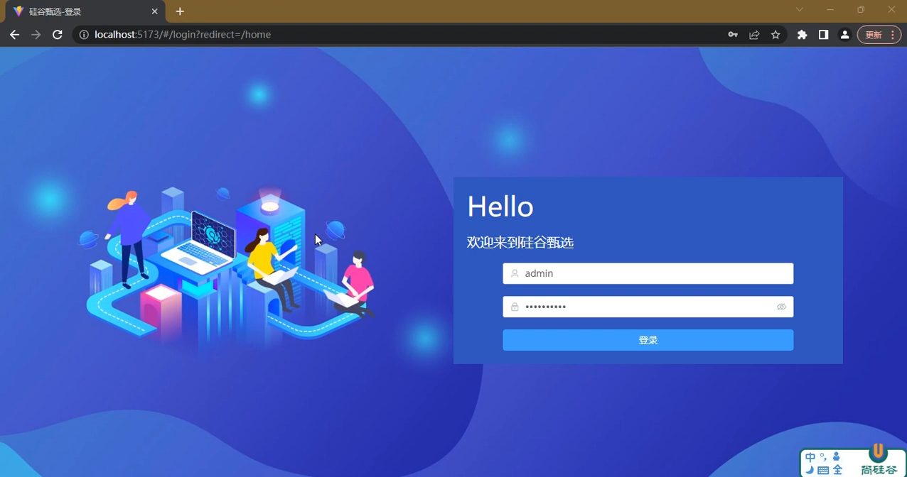（亦见 [`路由构建笔记.md`](./03.路由构建笔记.md)）

### 阶段 3：路由守卫 + 动态权限路由 + URL 规范化

- `beforeEach` 守卫（未登录拦截 / 已登录访问 `/login` 踢回首页）+ `asyncRoutes` 按 `userInfo.routes` 列表筛选 + `filterAsyncRoute`（**忽略大小写**）+ 动态 `addRoute` + `anyRoute` 兜底。
- 文件：`src/router/index.ts`(守卫)、`src/utils/routeFilter.ts`、`src/store/modules/user.ts`(`getUserInfo`)、`src/main.ts`(`normalizePathnameToHash()`)
- 参考：[`路由守卫与动态权限路由实现.md`](./04.路由守卫与动态权限路由实现.md)
- ⚠️ 坑 1：后端 `routes` 返回大写（`User`），前端 `name` 小写（`user`），`filterAsyncRoute` 必须 `toLowerCase()` 比对，否则异步菜单全被过滤。
- ⚠️ 坑 2：以 pathname 形式（如 `/login`）直接访问时，在 `main.ts` 入口纠正为 hash 形式（`/#/login`），排除 Vite 开发/静态资源，避免 `/login#/home` 异常 URL。

### 阶段 4：首页

- **目标**：登录后第一个页面，问候欢迎页（头像 + 时间段问候语 + 用户名 + 平台名 + 插画）。
- **内容**：左侧圆形头像图标（蓝色底 + welcome.svg）+ "上午好/下午好/晚上好 admin" 问候语 + "硅谷甄选运营平台" 副标题；右侧插画图片。整体居中展示在 el-card 中。
- **文件**：
  - `src/views/home/index.vue`【重写】问候卡片 + 插画布局，从 Pinia userStore 取用户名
  - `src/assets/home-illustration.png`【新增】首页右侧插画图片（需自行准备）
- **前置素材**：`src/icons/welcome.svg` 已有（头像图标）；插画图片需自行放入 `src/assets/`
- **验证**：`vue-tsc` 类型检查 + `pnpm dev` 看渲染效果。
- 实现步骤（手把手）：[`阶段4·首页问候页实现指南.md`](./07.阶段4·首页问候页实现指南.md)
- 最终效果：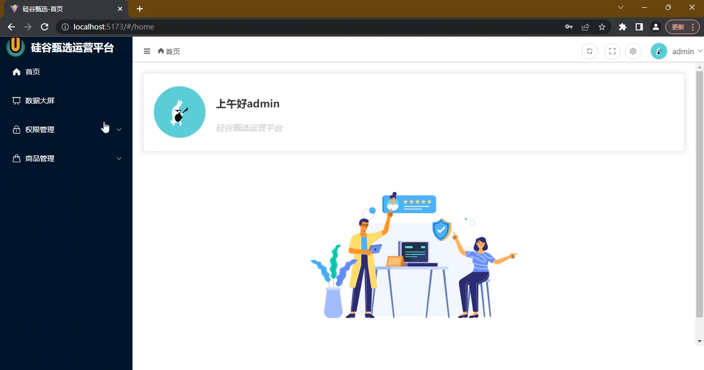（见 [`路由构建笔记.md`](./03.路由构建笔记.md)）

### 阶段 5：Layout 顶栏完善

- **目标**：把 `layout_tabbar` 占位文本做成真实顶栏。
- **内容**：面包屑（按 `route.matched`）、全屏（**原生 Fullscreen API**；若要用 `screenfull` 需先 `pnpm add screenfull`，当前 `package.json` 未含此依赖）、暗黑模式（切换 `html.dark` + Element Plus 暗黑变量）、主题色选择器（动态改 `--el-color-primary`）、用户头像下拉（个人信息 / 退出登录）、问候语弹出。
- **文件**：`src/layout/index.vue`(tabbar 区) + 新增 tabbar 子组件（breadcrumb / setting / userinfo 等）。
- 最终效果：主题色 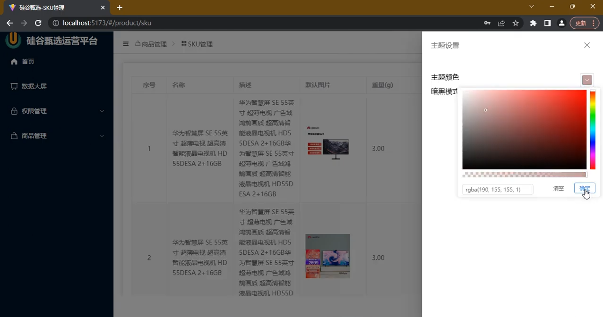、暗黑模式 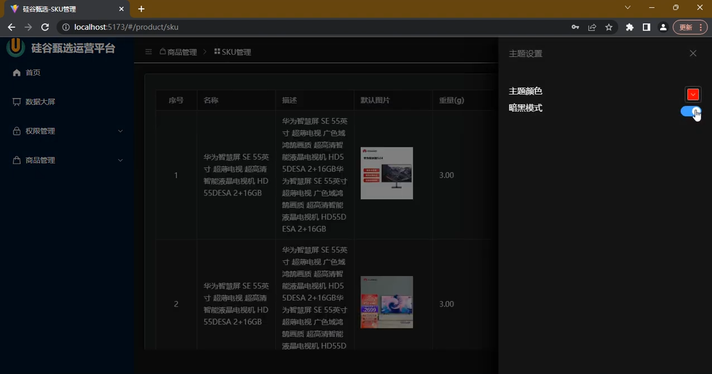、问候语 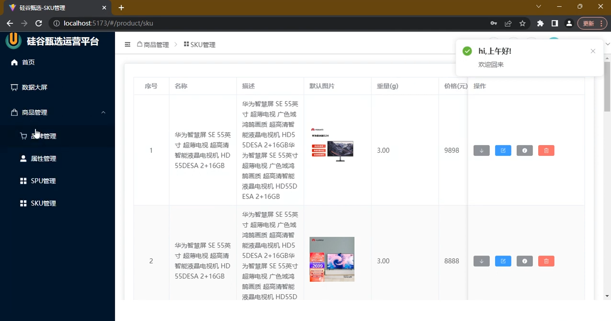（见 [`路由构建笔记.md`](./03.路由构建笔记.md)）

### 阶段 6~8：ACL 权限体系（用户 / 角色 / 菜单权限）

> ✅ **对接真实后端**（非 mock）：`.env.development` 已配 `VITE_API_BASE_URL=http://127.0.0.1:9000`，全部接口契约以 `apps/server` 真实实现为准（路径/参数详见 swagger `:9000/swagger/doc.json`；响应以 `code===200` 成功；`doAssign` 等 query 参数写法以后端 `handler` 为准）。注：本仓库不含 MSW，无需关闭。

- **阶段 6 用户管理**：用户列表（分页/搜索/增删改查）+ 分配角色。文件：`src/views/acl/user/index.vue`【重写】、`src/api/acl/user/*`【新建】
- **阶段 7 角色管理 + 分配权限**：角色列表 + 「分配权限」弹窗（`el-tree`）。文件：`src/views/acl/role/index.vue`【新建】、`src/api/acl/role/*`【新建】
- **阶段 8 菜单管理**：菜单树（`el-table` 树形）+ 增删改。文件：`src/views/acl/permission/index.vue`【新建】、`src/api/acl/permission/*`【新建】
- 实现细节见 [`阶段6-8·ACL权限体系实现指南.md`](./09.阶段6-8·ACL权限体系实现指南.md)
- 效果截图：用户管理 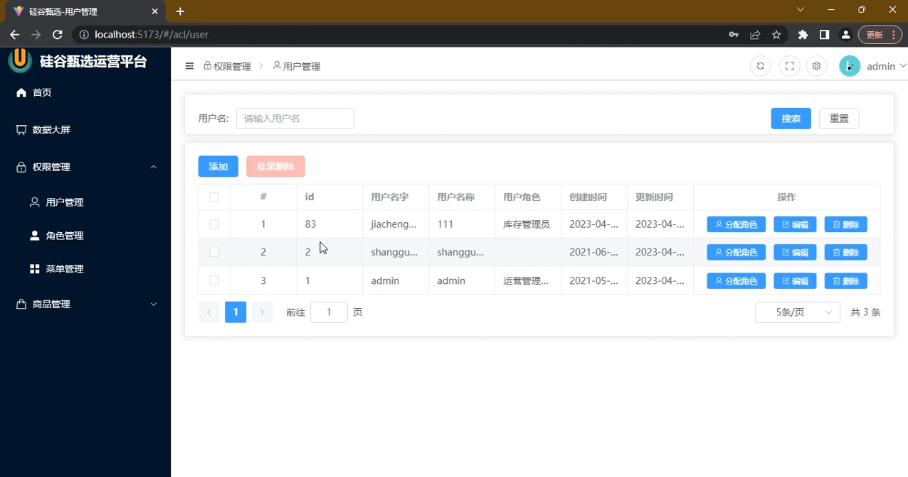、角色管理 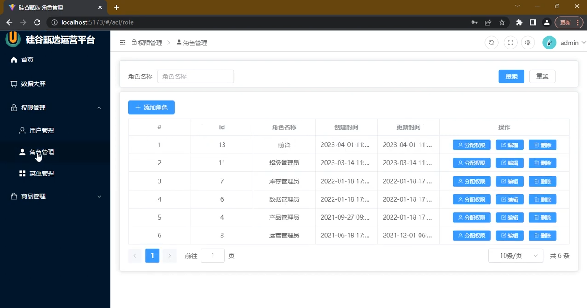、分配权限弹窗 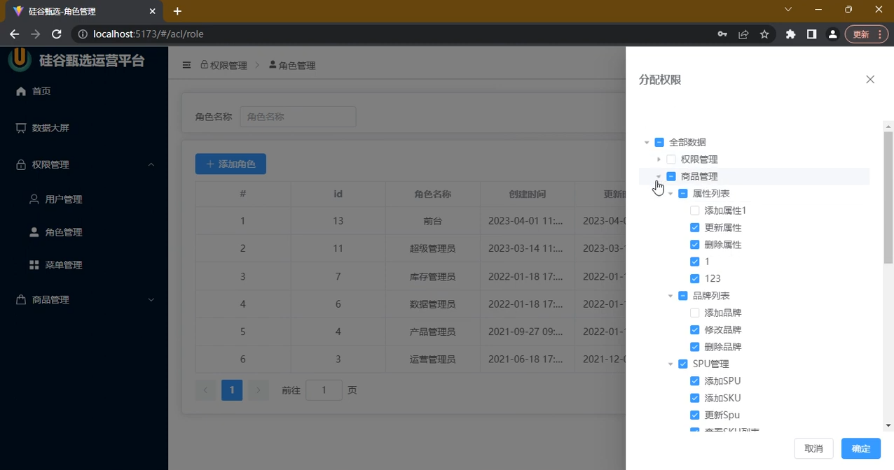（见 [`路由构建笔记.md`](./03.路由构建笔记.md)）

### 阶段 9~12：商品管理

> ✅ **对接真实后端**（非 mock）：与阶段 6~8 同一套后端，`.env.development` 已配 `VITE_API_BASE_URL`，`main.ts` 的 MSW 已关闭。文件上传的 `el-upload` 因不走 axios 拦截器需单独配 `:action` 全 URL + `:headers` token（详见指南 9.2）。

- **品牌管理**：表格 + 新增/编辑 + 图片上传。文件：`src/views/product/trademark`、`src/api/product/trademark` / `fileUpload`(目录待新建)
- **属性管理(attr)**：三级分类联动 + 属性值维护。文件：`src/views/product/attr`、`src/components/CategorySelect`
- **分类管理(category)**：独立的三级分类管理页，联动下拉 + 表格新增一/二/三级分类；文件：`src/views/product/category`，下拉复用 `src/components/CategorySelect`
- **SPU 管理**：SPU 增删改查 + 销售属性 + 图片 + 关联 SKU。文件：`src/views/product/spu`
- **SKU 管理**：SKU 列表 + 上架/下架 + 详情表。文件：`src/views/product/sku`
- 实现细节见 [`阶段9-12·商品管理实现指南.md`](./10.阶段9-12·商品管理实现指南.md)
- 最终效果：品牌管理 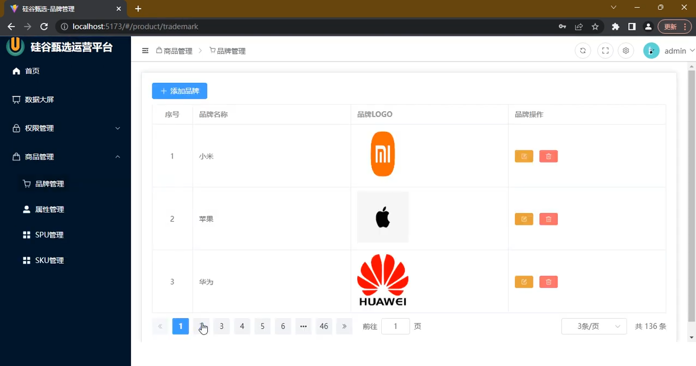、属性管理 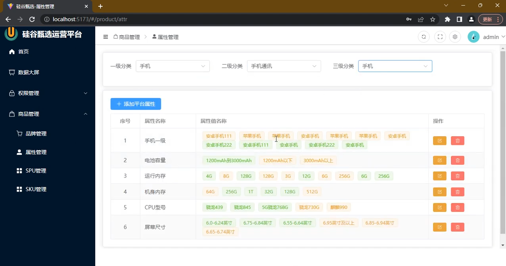、SPU 管理 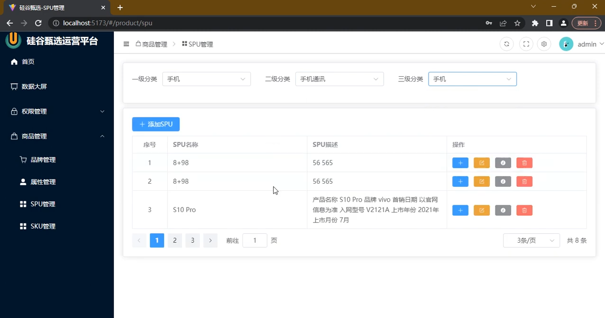、SKU 管理 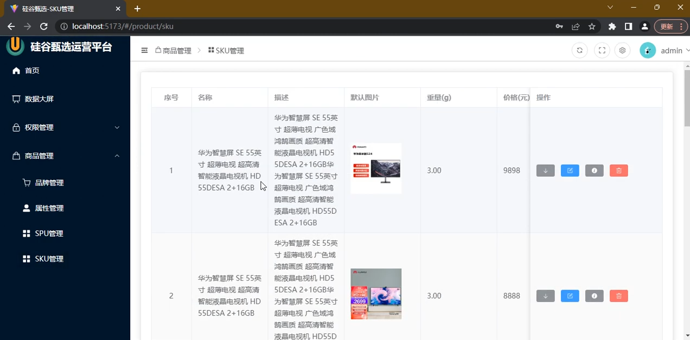 / 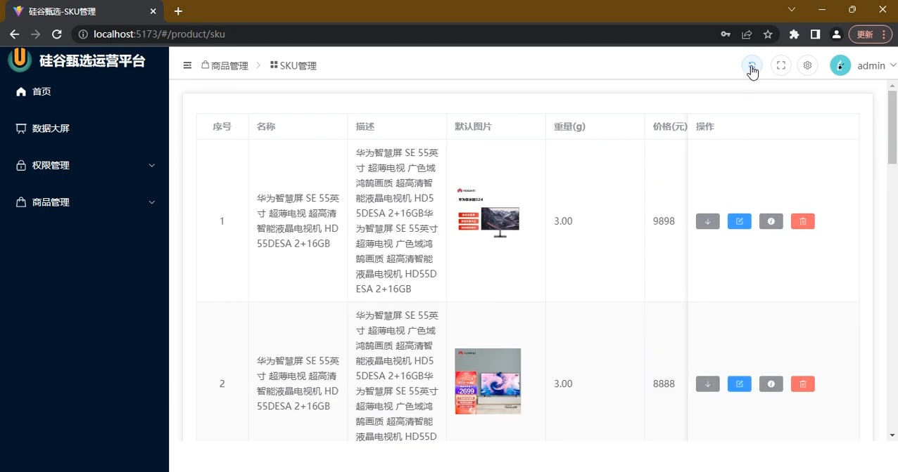（见 [`路由构建笔记.md`](./03.路由构建笔记.md)）

### 阶段 13：按钮级权限 `v-auth`

- 根据 `userInfo.buttons`（如 `btn.Trademark.add`）显示/隐藏按钮。
- 文件：`src/directives/auth.ts`【新增】+ `main.ts` 注册；模板用 `v-auth="'btn.Trademark.add'"`。
- 数据来源：对接真实后端，`/api/v1/acl/user/info` 返回的 `userInfo.buttons` 数组即按钮权限；`admin` 账号返回全部标识。
- 实现细节见 [`阶段13-14·按钮权限与切页动画实现指南.md`](./11.阶段13-14·按钮权限与切页动画实现指南.md)

### 阶段 14：切页动画

- `src/layout/main/index.vue` 的 `<router-view />` 扩成 `v-slot` + `<transition>`（淡入 + 缩放）。
- 实现细节见 [`阶段13-14·按钮权限与切页动画实现指南.md`](./11.阶段13-14·按钮权限与切页动画实现指南.md)

### 阶段 15：数据大屏 ⏸️（最后实现）

- 全屏 ECharts 大屏「智慧旅游可视化大数据展示平台」，数据为本地 mock（不接 MSW，保持自包含）。
- 届时需新建通用 `EChart.vue` 封装组件 + 本地 `mockData.ts`，等其它阶段做完再单独实现。
- 文件：`src/components/EChart.vue`【新增】、`src/views/screen/index.vue`【重写】、`src/views/screen/mockData.ts`【新增】、`package.json`【改】`+ echarts`
- 最终效果：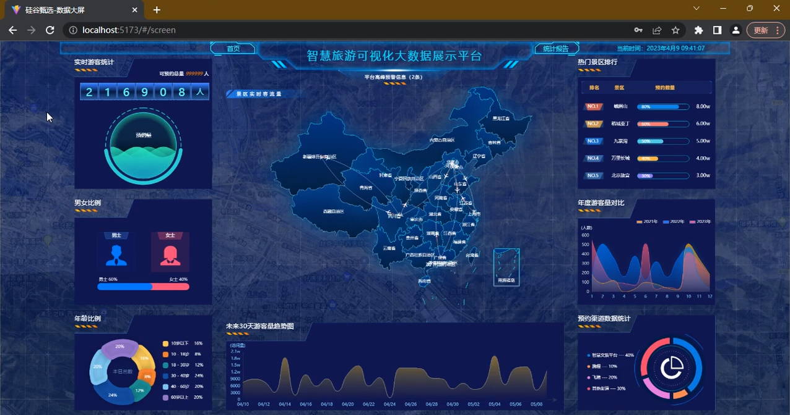（见 [`路由构建笔记.md`](./03.路由构建笔记.md))

### 阶段 16：打包与上线部署

> 本项目是**哈希路由 + 纯静态产物**，部署形态极简。详细步骤、Nginx 同源反代示例、以及 **Docker 镜像化（dist + nginx 同镜像）** 做法已拆到独立指南：
>
> 👉 [`阶段16·打包与上线部署.md`](./13.阶段16·打包与上线部署.md)

要点速览：

- **为什么简单**：哈希路由无需服务端兜底；`.env.production` 已就位（`VITE_API_BASE_URL=/api`）；MSW 生产构建不带入。
- **✅ 推荐做法**：同一个 Nginx 实例托管前端 + 反代后端（同源部署，前端用 `/api` 相对路径，免跨域、不写死 IP、换后端不重打包）。
- **🐳 进阶做法**：用多阶段 `Dockerfile` 把 `dist/` 和 nginx 打进同一镜像（项目已新增 `Dockerfile`、`.dockerignore`、`nginx.conf`），便于容器化部署与回滚。
- **两个坑**：`vue-tsc -b` 类型检查会卡 build；子路径部署需改 `vite.config.ts` 的 `base`。

---

## 三、推荐实现顺序

按依赖关系，建议如下顺序推进：

1. **阶段 0~3 基础**：工程化 → 路由骨架 → 登录 → 路由守卫+动态权限+URL 规范化，打通「能登录、菜单按权限显示、页面可切换」的框架。
2. **阶段 4 首页**：登录后首屏欢迎页（头像 + 问候语 + 插画）。
3. **阶段 5 Layout 顶栏**：让整体像样（面包屑/退出/暗黑/主题）。
4. **阶段 6~8 ACL**：权限体系落地（用户/角色/权限）。
5. **阶段 9~12 商品**：工作量最大（表单/级联/上传）。
6. **阶段 13~14**：按钮权限、切页动画收尾。
7. **阶段 15 数据大屏（最后做）**：届时引入 echarts + EChart 封装 + 大屏页面，放整个项目收尾时单独实现。
8. **阶段 16 打包上线**：功能全做完后，推荐用**同一个 Nginx 实例托管前端 + 反代后端**（同源部署，免跨域、不写死 IP），或用**Docker 镜像化**（dist + nginx 同镜像）部署。详见 [`阶段16·打包与上线部署.md`](./13.阶段16·打包与上线部署.md)。

> 每个阶段开始前，建议先翻 [`路由构建笔记.md`](./03.路由构建笔记.md) 对应截图确认目标效果，再动手。
