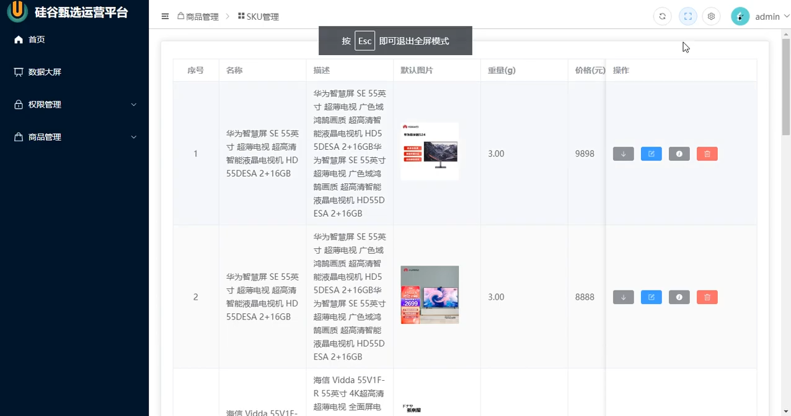
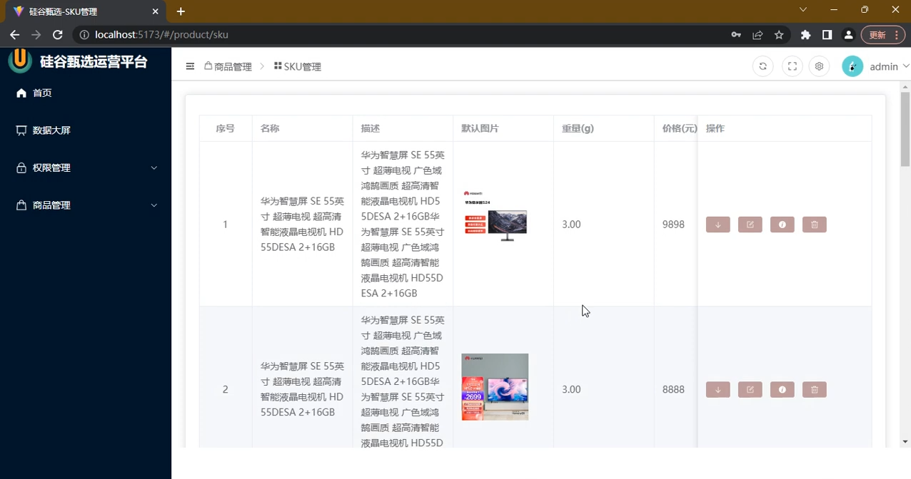

# 03. 硅谷甄选 · 阶段一：路由骨架搭建

> 本文档目标：**先把所有页面用占位件建出来 + 配好完整路由表 + 搭好 Layout 和菜单，让项目能跑、菜单能点、页面能切换。本阶段不写任何具体业务逻辑（登录、权限、axios、守卫等），那些留到后续阶段逐个"填肉"。**

---

## 〇、本阶段范围（重要）

| 本阶段做 ✅                           | 本阶段不做 ❌                    |
| ------------------------------------- | -------------------------------- |
| 建全部占位页面（空壳）                | 登录业务逻辑                     |
| 配完整路由表（含 meta）               | 路由守卫 / 登录拦截              |
| 搭 Layout 三栏 + Logo + 菜单 + 内容区 | 根据权限动态筛选路由             |
| 菜单能点击切换页面                    | axios 请求 / token 持久化        |
| 静态路由表直接驱动菜单                | 页面具体业务（表单、表格、图表） |
|                                       | 暗黑模式 / 主题切换              |

> 一句话：**先把骨架打通，跑起来看到整体布局和导航，再回头逐个模块做业务。**

---

## 0、开始前：安装依赖

项目需要 `vue-router`，先装上：

```bash
pnpm add vue-router
```

---

## 一、目录结构（本阶段最终形态）

```text
src/
├── views/                         # + 页面级组件（本阶段全是占位）
│   ├── login/index.vue            # 登录页
│   ├── home/index.vue             # 首页
│   ├── 404/index.vue              # 404
│   ├── screen/index.vue           # 数据大屏
│   ├── acl/
│   │   ├── user/index.vue         # 用户管理
│   │   ├── role/index.vue         # 角色管理
│   │   └── permission/index.vue   # 菜单/权限管理
│   └── product/
│       ├── trademark/index.vue    # 品牌管理
│       ├── attr/index.vue         # 属性管理
│       ├── category/index.vue     # 分类管理
│       ├── spu/index.vue          # SPU 管理
│       └── sku/index.vue          # SKU 管理
├── layout/                        # + 后台整体布局
│   ├── index.vue                  # 三栏容器
│   ├── logo/index.vue             # 左上角 Logo
│   ├── menu/index.vue             # 递归左侧菜单
│   └── main/index.vue             # 右侧内容区（二级路由出口）
├── router/                        # + 路由
│   ├── index.ts                   # 创建并导出路由实例
│   └── routes.ts                  # 完整路由表 constantRoute
├── settings.ts                    # + 项目标题 / logo 配置
├── styles/
│   ├── variables.scss             # 已存在，本阶段在末尾追加布局变量
│   └── element/index.scss         # Element Plus 主题变量覆盖
├── icons/                         # 本地 svg（home/lock/logout... 用 <SvgIcon name="home"/>）
├── mocks/                         # msw mock 接口（可选，仅无后端时启用；当前已对接真实后端、默认关闭）
├── App.vue                        # 根组件，放 <router-view>
└── main.ts                        # 入口，注册 router
```

---

## 二、步骤 2：一次性建好所有占位页面

每个页面本阶段只放占位内容，格式统一如下（把文字换成对应页面名即可）：

```vue
<template>
  <div>【占位】XXX 页面</div>
</template>
<script setup lang="ts"></script>
```

> **建哪些文件？直接照【一节】目录结构落地即可**
需要建的有两类：
>
> 1. **页面级占位**：`views/` 下的 11 个页面（login / home / 404 / screen / acl 下 3 个 / product 下 5 个），每个都用上面的占位模板，把文字换成对应页面名。
> 2. **Layout 四件套**：`layout/index.vue`、`layout/logo/index.vue`、`layout/menu/index.vue`、`layout/main/index.vue` —— 本阶段先按占位模板各建空壳，具体内容在【步骤 6】逐个展开写。

### 各页面最终效果

**登录页**（`views/login`）— URL `/#/login`，"Hello 欢迎来到硅谷甄选" + admin 密码表单


**首页**（`views/home`）— URL `/#/home`，左侧菜单 + 右侧"上午好 admin"


**数据大屏**（`views/screen`）— URL `/#/screen`，"智慧旅游可视化大数据展示平台" ECharts 大屏


**权限管理**（`views/acl`）

- 用户管理 `acl/user`：URL `/#/acl/user`，用户列表表格（jiacheng / shanggu / admin）
  
- 角色管理 `acl/role`：URL `/#/acl/role`，角色列表（前台 / 超级管理员 / 库存管理员等）
  
- 角色管理 — 分配权限弹窗：点击"分配权限"按钮后弹出的权限树（全部数据 > 权限管理 > 商品管理）
  

> 注：本套截图里没有独立的 `acl/permission`（菜单/权限管理）页面截图。分配权限功能以弹窗形式集成在角色管理页面中。

**商品管理**（`views/product`）

- 品牌管理 `product/trademark`：URL `/#/product/trademark`，小米 / 苹果 / 华为品牌 + LOGO 表格
  
- 属性管理 `product/attr`：URL `/#/product/attr`，手机属性值（一级分类手机 / 二级分类手机通讯 / 三级分类手机）
  
- 分类管理 `product/category`：URL `/#/product/category`，三级分类联动下拉 + 表格（一级 / 二级 / 三级），可新增分类；下拉组件为公共 `CategorySelect`（被 attr 页复用）
- SPU 管理 `product/spu`：URL `/#/product/spu`，SPU 列表（8+98 / S10 Pro）
  
- SKU 管理 `product/sku`：URL `/#/product/sku`，含图片 / 重量 / 价格的 SKU 详细表
  
  

**顶栏功能**（挂在 Layout 顶部 `layout_tabbar`，后续阶段实现，均在 SKU 页面上演示）

- 全屏提示：按 Esc 退出全屏模式
  
- 设置面板（主题颜色 + 暗黑模式开关）
  
- 主题颜色选择器（色盘面板打开）
  
- 暗黑模式效果（整页变暗黑）
  
- 问候语弹出（"hi,上午好! 欢迎回来"，出现在页面右上角）
  

---

## 三、步骤 3：配置完整路由表 `src/router/routes.ts`

```ts
// 对外暴露常量路由（本阶段为静态路由，后续权限阶段会在此基础上筛选）
export const constantRoute = [
  // 登录页（不挂 Layout，隐藏于菜单）
  {
    path: '/login',
    component: () => import('@/views/login/index.vue'),
    meta: { title: '登录', hidden: true },
  },

  // Layout 容器 + 首页
  {
    path: '/',
    component: () => import('@/layout/index.vue'),
    redirect: '/home',
    children: [
      {
        path: 'home',
        component: () => import('@/views/home/index.vue'),
        meta: { title: '首页', icon: 'HomeFilled' },
      },
    ],
  },

  // 数据大屏（全屏独立页，不挂 Layout，单层即可）
  {
    path: '/screen',
    component: () => import('@/views/screen/index.vue'),
    meta: { title: '数据大屏', icon: 'Histogram' },
  },

  // 权限管理 acl
  {
    path: '/acl',
    component: () => import('@/layout/index.vue'),
    redirect: '/acl/user',
    meta: { title: '权限管理', icon: 'Lock' },
    children: [
      {
        path: 'user',
        component: () => import('@/views/acl/user/index.vue'),
        meta: { title: '用户管理', icon: 'UserFilled' },
      },
      {
        path: 'role',
        component: () => import('@/views/acl/role/index.vue'),
        meta: { title: '角色管理', icon: 'UserFilled' },
      },
      {
        path: 'permission',
        component: () => import('@/views/acl/permission/index.vue'),
        meta: { title: '权限管理', icon: 'Lock' },
      },
    ],
  },

  // 商品管理 product
  {
    path: '/product',
    component: () => import('@/layout/index.vue'),
    redirect: '/product/trademark',
    meta: { title: '商品管理', icon: 'Goods' },
    children: [
      {
        path: 'trademark',
        component: () => import('@/views/product/trademark/index.vue'),
        meta: { title: '品牌管理', icon: 'Stamp' },
      },
      {
        path: 'attr',
        component: () => import('@/views/product/attr/index.vue'),
        meta: { title: '属性管理', icon: 'Files' },
      },
      {
        path: 'category',
        component: () => import('@/views/product/category/index.vue'),
        meta: { title: '分类管理', icon: 'Menu' },
      },
      {
        path: 'spu',
        component: () => import('@/views/product/spu/index.vue'),
        meta: { title: 'Spu管理', icon: 'Goods' },
      },
      {
        path: 'sku',
        component: () => import('@/views/product/sku/index.vue'),
        meta: { title: 'Sku管理', icon: 'Goods' },
      },
    ],
  },

  // 404
  {
    path: '/404',
    component: () => import('@/views/404/index.vue'),
    meta: { title: '404', hidden: true },
  },

  // 任意未匹配路径 -> 重定向到 404（hidden 避免菜单渲染出空白项）
  {
    path: '/:pathMatch(.*)*',
    redirect: '/404',
    meta: { hidden: true },
  },
]
```

> 说明：
>
> - `() => import(...)` 是**路由懒加载**，按需加载组件。
> - `meta.hidden: true` 的路由**不显示在左侧菜单**（登录、404）。数据大屏是独立全屏页、不挂 Layout，本身就没有内层，所以不需要 hidden。
> - **子路由 `path` 的写法**：不以 `/` 开头是**相对路径**，Vue Router 会自动拼上父路由路径（如父 `/acl` + 子 `user` = `/acl/user`）；以 `/` 开头是**绝对路径**，需自己写全。本项目统一用**相对写法**（`user`、`role`、`trademark`…），改父路径时子路由不用跟着改，更好维护。`redirect` 目标是完整跳转地址，仍写绝对路径（如 `redirect: '/acl/user'`）。
> - 本阶段所有路由都放进 `constantRoute`，后续"权限阶段"会引入 `asyncRoute` 按用户角色筛选。

---

## 四、步骤 4：创建路由实例 `src/router/index.ts`

```ts
import { createRouter, createWebHashHistory } from 'vue-router'
import { constantRoute } from './routes'

const router = createRouter({
  // 哈希模式（部署简单，不需要服务器配置）
  history: createWebHashHistory(),
  routes: constantRoute,
  // 路由切换时滚动到顶部
  scrollBehavior() {
    return { left: 0, top: 0 }
  },
})

export default router
```

---

## 五、步骤 5：入口注册 & 路由出口

### `src/main.ts`

```ts
import { createApp } from 'vue'
import './style.css'
import App from './App.vue'
import SvgIcon from '~virtual/svg-component' // 插件生成的虚拟模块（本地 svg 图标）
import router from '@/router' // 路由实例


const app = createApp(App)
app.component('SvgIcon', SvgIcon) // 注册全局 svg 组件
app.use(router) // 注册路由
app.mount('#app')
```

> **不用手动 import element-plus 样式。** `vite.config.ts` 里 `ElementPlusResolver({ importStyle: 'sass' })` 会在按需导入组件时**自动带上对应的 sass 样式**，所以既不用 `app.use(ElementPlus)` 全量注册，也不用 `import 'element-plus/dist/index.css'`。

### `src/App.vue`

```vue
<template>
  <!-- 一级路由出口：匹配到的组件渲染到这里 -->
  <router-view></router-view>
</template>

<script setup lang="ts"></script>
```

`<router-view>` 自己不画任何东西，只是个"坑"——路由匹配到哪个组件，就把哪个塞进来。访问 `/home` 时，路由表同时命中父路由 `/`（→ `Layout`）和子路由 `home`（→ `Home`），于是 **`Layout` 先画外壳，画到内部 `<router-view>` 时才把 `Home` 塞进内容区**。`/home` 只负责右侧内容，外框由父路由的 `Layout` 画。

分层完全由路由表决定，和 `<router-view>` 自身无关：

```ts
{
  path: '/',
  component: () => import('@/layout/index.vue'),  // 顶层 component → 进 App.vue 一级 <router-view>
  redirect: '/home',
  children: [
    { path: 'home', component: () => import('@/views/home/index.vue') }, // → 进 Layout 内 Main 的二级 <router-view>
  ],
}
```

- 顶层 `component: Layout` → 塞进 `App.vue` 一级出口（外层外壳）
- `children` 里 `component: views/home` → 塞进 `Layout` 内 `Main` 的二级出口（内层内容）
- 改路由表结构分层就跟着变，`App.vue` / `Layout` 代码一字不动——这就是"路由驱动视图"。

> **一句话规则**：`<router-view>` 写在哪个组件里，下一层子路由页面就显示在那里；想再往下分，就在那层组件里再放一个 `<router-view />`。

---

## 六、步骤 6：搭建 Layout（三栏）+ 子组件

### 6.1 样式变量：`src/styles/variables.scss`

`src/styles/variables.scss` 已存在（内含 `$sidebar-width`、`flex-center` 等），本阶段在文件**末尾追加**以下布局变量：

```scss
// —— 布局变量（追加到 variables.scss 末尾）——
$base-menu-width: 260px; // 左侧菜单宽度
$base-tabbar-height: 50px; // 顶部导航高度
$base-menu-background: #001529; // 左侧菜单背景色
$base-tabbar-background: #fff; // 顶部导航背景色
```

> 这些变量已通过 `vite.config.ts` 的 `additionalData: @use "@/styles/variables.scss" as *` **全局注入**，所以任何 `.vue` 的 `<style lang="scss">` 里可以**直接用** `$base-menu-width`，无需手动 `@use`。

### 6.2 全局样式（html/body/#app 铺满）

入口 `main.ts` 已 `import './style.css'`（见 5 节）。`src/style.css` 默认是 Vite 落地页 demo 样式（`#app { width: 1126px; display: flex; margin: 0 auto; ... }`），与后台全屏布局**冲突**，因此本阶段把它的内容**整体替换为**下面的全局重置（不是"追加"）：

```css
* {
  margin: 0;
  padding: 0;
  box-sizing: border-box;
}

html,
body,
#app {
  width: 100%;
  height: 100%;
}
```

> 替换后原来的 landing page 样式即被移除——`App.vue` 只放 `<router-view>`，不再依赖那些 `.hero` 等 demo 类。

### 6.3 项目配置（只需新建 `src/settings.ts`，vite.config.ts 不动）

`src/settings.ts`（新建）：

```ts
export default {
  title: '硅谷甄选',
  logo: 'https://www.tsinghua.edu.cn/favicon.ico', // 换成你自己的 logo
  logoShow: true, // 是否显示 logo：true 显示，false 隐藏
}
```

> 本项目的 `vite.config.ts` 已配好自动按需导入，本阶段无需改动。写组件时直接用即可，无需手动 `import`：
>
> - **Element Plus 组件**：模板里写 `<el-button>` 等，`el-*` 自动按需导入（带 sass 样式），也不需 `app.use(ElementPlus)` 全量注册。
> - **图标两套**：静态图标用 `<IconEpXxx />`（unplugin）或 `<SvgIcon name="home" />`（本地 svg）；菜单里的**动态图标**（字符串名 `meta.icon`）无法被自动扫描识别，需在 6.7 建"名字→组件"映射表手动 `import`。
> - **全局样式变量**：`styles/variables.scss` 已通过 `additionalData` 全局注入，任何 `.vue` 里可直接用 `$base-menu-width` 等，无需手动 `@use`。

### 6.4 布局容器 `src/layout/index.vue`

```vue
<template>
  <div class="layout_container">
    <div class="layout_slider">
      <Logo v-if="setting.logoShow" />
      <!-- 左侧菜单组件：:menuList 是 v-bind 简写，把路由表传给 Menu 去渲染 -->
      <!-- 菜单数据就是静态的 constantRoute，Layout 直接传一层 props 即可 -->
      <Menu :menuList="constantRoute" />
    </div>
    <div class="layout_tabbar">顶部导航（后续做面包屑/全屏/退出）</div>
    <div class="layout_main">
      <!-- 右侧内容区：Main 内部有 <router-view>，子路由页面掉进这里 -->
      <Main />
    </div>
  </div>
</template>

<script setup lang="ts">
import { constantRoute } from '@/router/routes' // 静态路由表，直接作为菜单数据源
import setting from '@/settings'
import Logo from './logo/index.vue'
import Menu from './menu/index.vue' // 左侧菜单组件（./menu/index.vue）
import Main from './main/index.vue'
</script>

<style scoped lang="scss">
.layout_container {
  width: 100%;
  height: 100vh;
  .layout_slider {
    width: $base-menu-width;
    height: 100vh;
    background: $base-menu-background;
  }
  .layout_tabbar {
    position: fixed;
    width: calc(100% - $base-menu-width);
    height: $base-tabbar-height;
    top: 0;
    left: $base-menu-width;
    background: $base-tabbar-background;
    line-height: $base-tabbar-height;
    padding-left: 20px;
  }
  .layout_main {
    position: absolute;
    left: $base-menu-width;
    top: $base-tabbar-height;
    width: calc(100% - $base-menu-width);
    height: calc(100vh - $base-tabbar-height);
    padding: 20px;
    overflow: auto;
  }
}
</style>
```

### 6.5 Logo `src/layout/logo/index.vue`

```vue
<template>
  <div class="logo" v-if="setting.logoShow">
    
    <p>{{ setting.title }}</p>
  </div>
</template>

<script setup lang="ts">
import setting from '@/settings'
</script>

<style scoped lang="scss">
.logo {
  display: flex;
  align-items: center;
  height: $base-tabbar-height;
  color: #fff;
  img {
    width: 40px;
    height: 40px;
    margin: 0 10px;
  }
  p {
    font-size: 18px;
  }
}
</style>
```

### 6.6 内容区 `src/layout/main/index.vue`（二级路由出口）

```vue
<template>
  <router-view />
</template>
```

`Main` 是右侧内容区，里面只放一个**二级路由出口** `<router-view />`——真正显示 home / acl/user 等页面的地方。本阶段 `Main.vue` 保持最简。

> **切页动画（淡入 + 缩放）本阶段暂不实现**，留到后续阶段再加。到时只需把这一行 `<router-view />` 扩成 `v-slot` + `<transition>` 的形式（详见后续"切页动画"小节），不影响当前框架。

### 6.7 递归菜单 `src/layout/menu/index.vue`（本阶段核心）

```vue
<template>
  <!-- isRoot=true 才包一层 <el-menu>（菜单项依赖它的上下文）；递归进来的子层 isRoot=false，只输出节点 -->
  <el-menu v-if="isRoot" :default-active="$route.path" background-color="#001529" text-color="#fff" active-text-color="#409eff">
    <SideMenu :menu-list="menuList" :parent-path="parentPath" :is-root="false" />
  </el-menu>

  <template v-else>
    <template v-for="item in menuList" :key="item.path">
      <!-- 叶子节点：无子路由，或只有 1 个子路由时，取实际要显示的那一项；该项 hidden 则不渲染 -->
      <el-menu-item
        v-if="isLeaf(item) && !leaf(item).meta?.hidden"
        :index="resolvePath(leaf(item).path)"
        @click="goRoute(resolvePath(leaf(item).path))"
      >
        <el-icon><component :is="getIcon(leaf(item).meta?.icon)" /></el-icon>
        <span>{{ leaf(item).meta?.title }}</span>
      </el-menu-item>

      <!-- 多个子路由 -> 折叠成子菜单（无标题的父路由不渲染，避免空标题项），递归渲染下层 -->
      <el-sub-menu v-else-if="item.children && item.children.length > 1 && item.meta?.title" :index="resolvePath(item.path)">
        <template #title>
          <el-icon><component :is="getIcon(item.meta?.icon)" /></el-icon>
          <span>{{ item.meta?.title }}</span>
        </template>
        <SideMenu :menu-list="item.children" :parent-path="resolvePath(item.path)" :is-root="false" />
      </el-sub-menu>
    </template>
  </template>
</template>

<script setup lang="ts">
import { useRouter } from 'vue-router'
import type { RouteRecordRaw } from 'vue-router'
import type { Component } from 'vue'
// 自动导入扫不到动态字符串 :is，手动 import 菜单用到的图标（routes.ts 里 meta.icon 用到的名字都要登记）
import {
  HomeFilled, Histogram, Lock, UserFilled,
  Menu as MenuIcon, Goods, Stamp, Files,
} from '@element-plus/icons-vue'

const props = withDefaults(
  defineProps<{ menuList: RouteRecordRaw[]; parentPath?: string; isRoot?: boolean }>(),
  { isRoot: true }, // 最外层默认包 <el-menu>，递归子层显式传 false
)
const $router = useRouter()

// 叶子：无子路由，或只有 1 个子路由；单子时取那 1 个当显示项
const isLeaf = (item: RouteRecordRaw) => !item.children || item.children.length <= 1
const leaf = (item: RouteRecordRaw) => (item.children?.length === 1 ? item.children[0] : item)

// 子项 path 是相对的（如 'user'）拼成完整路径（如 '/acl/user'），保证 :index 与 $route.path 对上
const resolvePath = (path: string) =>
  path.startsWith('/') ? path : props.parentPath ? `${props.parentPath}/${path}` : `/${path}`

// meta.icon 是字符串（如 'HomeFilled'），查映射表转成组件；空则返回 undefined 不渲染图标
const iconMap: Record<string, Component> = { HomeFilled, Histogram, Lock, UserFilled, Menu: MenuIcon, Goods, Stamp, Files }
const getIcon = (icon?: string): Component | undefined => (icon ? iconMap[icon] : undefined)

const goRoute = (path: string) => $router.push(path)
</script>

<!-- 递归组件必须声明名字，才能自己调用自己（不能用 'Menu'，HTML 已有 <menu> 保留标签） -->
<!-- RouteMeta 扩展：声明菜单用到的自定义字段，全局生效 -->
<script lang="ts">
declare module 'vue-router' {
  interface RouteMeta {
    title?: string
    icon?: string
    hidden?: boolean
  }
}
export default { name: 'SideMenu' }
</script>
```

菜单组件 `SideMenu` 通过"自己调用自己"实现**递归**，支持任意层级（权限管理 > 用户管理…）。

⚠️ **为什么用 `resolvePath` 拼完整路径？** 路由表子项 `path` 是相对的（如 `user`），直接拿它当 `:index` 会和 `default-active="$route.path"`（完整路径 `/acl/user`）对不上——嵌套菜单会**高亮失效 + 点错页**。所以递归时把父路径一层层往下带，用 `resolvePath` 拼成完整路径再交给 `:index` 和 `goRoute`。

> **根路由 `/` 怎么显示成"首页"？** `isLeaf` 把"无子 / 只有 1 个子"都当叶子，根路由 `/` 只有 `home` 一个子项，于是取 `home` 当显示项，标题图标来自 `home` 自己的 `meta`。`el-sub-menu` 还加了 `item.meta?.title` 守卫：没标题的父路由不折叠成子菜单，避免空标题项。

### 递归菜单的三个关键细节

**① 怎么递归自己？** 组件要在模板里调自己，得先有个名字——`<script lang="ts">` 里 `export default { name: 'SideMenu' }`（不能用 `Menu`，和 HTML 的 `<menu>` 标签冲突）。每往下一层，就把当前项的 `children` 当新的 `menuList` 传进去，逐层收窄到没有子项为止。

**② 为什么用 `isRoot`？** `<el-menu-item>` 必须包在 `<el-menu>` 里才渲染。递归时若每层都包一个 `<el-menu>` 会层层套娃、样式乱掉，所以只在第一层（`isRoot=true`，已设默认值）包 `<el-menu>`，子层 `isRoot=false` 只输出节点。

**③ 图标为什么手动 `import`？** 菜单图标是 `meta.icon: 'HomeFilled'` 这种**字符串**，靠 `<component :is>` 运行时查组件；而 vite 自动导入只认模板里写死的标签、扫不到字符串名，所以得手动 `import` 图标、用 `iconMap` 做"字符串→组件"的映射表（`meta.icon` 用到的名字都要登记，否则图标不显示）。

**④ `meta` 字段哪来的？** `meta.title/icon/hidden` 是 `routes.ts` 里自定义挂的，`declare module 'vue-router'` 给 `RouteMeta` 补上这仨字段，TypeScript 才认。菜单显隐就读 `meta.hidden`（本阶段写死，权限阶段再改成按角色动态决定）。

---

## 七、验证（本阶段完成标志）

```bash
pnpm dev
```

检查：

- 访问 `/#/login` → 看到"登录页"占位
- 访问 `/#/` → 自动跳到 `/#/home`，看到三栏布局 + 左侧菜单
- 点左侧菜单「权限管理 / 用户管理」等 → 内容区切换到对应占位页
- 访问一个不存在的路径（如 `/#/abc`）→ 重定向到 404

✅ 全部满足，说明**路由骨架已打通**，本阶段结束。

---
