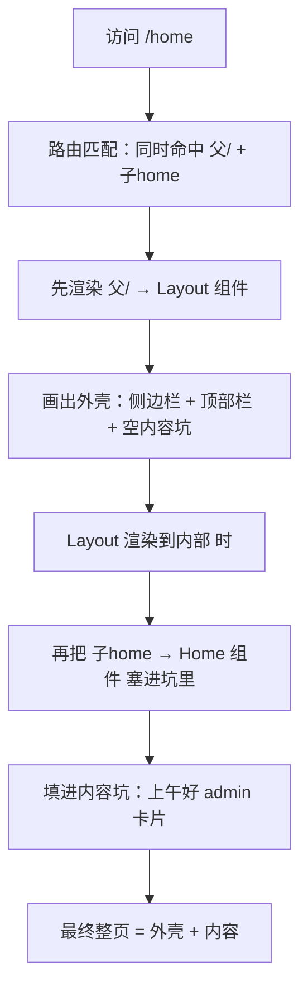

# 03. 硅谷甄选 · 阶段一：路由骨架搭建

> 本文档目标：**先把所有页面用占位件建出来 + 配好完整路由表 + 搭好 Layout 和菜单，让项目能跑、菜单能点、页面能切换。本阶段不写任何具体业务逻辑（登录、权限、axios、守卫等），那些留到后续阶段逐个"填肉"。**

---

## 〇、本阶段范围（重要）

| 本阶段做 ✅                           | 本阶段不做 ❌                    |
| ------------------------------------- | -------------------------------- |
| 建全部占位页面（空壳）                | 登录业务逻辑                     |
| 配完整路由表（含 meta）               | 路由守卫 / 登录拦截              |
| 搭 Layout 三栏 + Logo + 菜单 + 内容区 | 根据权限动态筛选路由             |
| 菜单能点击切换页面                    | axios 请求 / token 持久化        |
| Pinia 存路由表供菜单读取              | 页面具体业务（表单、表格、图表） |
|                                       | 暗黑模式 / 主题切换              |

> 一句话：**先把骨架打通，跑起来看到整体布局和导航，再回头逐个模块做业务。**

---

## 0、开始前：安装依赖

项目需要 `vue-router` 和 `pinia`，先装上：

```bash
pnpm add vue-router pinia
```

> `element-plus`、`@element-plus/icons-vue`、`axios` 已具备，无需再装。

---

## 一、目录结构（本阶段最终形态）

```text
src/
├── views/                         # + 页面级组件（本阶段全是占位）
│   ├── login/index.vue            # 登录页
│   ├── home/index.vue             # 首页
│   ├── 404/index.vue              # 404
│   ├── screen/index.vue           # 数据大屏
│   ├── acl/
│   │   ├── user/index.vue         # 用户管理
│   │   ├── role/index.vue         # 角色管理
│   │   └── permission/index.vue   # 菜单/权限管理
│   └── product/
│       ├── trademark/index.vue    # 品牌管理
│       ├── attr/index.vue         # 属性管理
│       ├── category/index.vue     # 分类管理
│       ├── spu/index.vue          # SPU 管理
│       └── sku/index.vue          # SKU 管理
├── layout/                        # + 后台整体布局
│   ├── index.vue                  # 三栏容器
│   ├── logo/index.vue             # 左上角 Logo
│   ├── menu/index.vue             # 递归左侧菜单
│   └── main/index.vue             # 右侧内容区（二级路由出口）
├── router/                        # + 路由
│   ├── index.ts                   # 创建并导出路由实例
│   └── routes.ts                  # 完整路由表 constantRoute
├── store/                         # + pinia 大仓库（先建壳，放 menuRoutes）
│   ├── index.ts
│   └── modules/user.ts
├── settings.ts                    # + 项目标题 / logo 配置
├── styles/
│   ├── variables.scss             # 已存在，本阶段在末尾追加布局变量
│   └── element/index.scss         # Element Plus 主题变量覆盖
├── icons/                         # 本地 svg（home/lock/logout... 用 <SvgIcon name="home"/>）
├── mocks/                         # msw mock 接口（可选，仅无后端时启用；当前已对接真实后端、默认关闭）
├── App.vue                        # 根组件，放 <router-view>
└── main.ts                        # 入口，注册 router + pinia
```

---

## 二、步骤 2：一次性建好所有占位页面

每个页面本阶段只放占位内容，格式统一如下（把文字换成对应页面名即可）：

```vue
<template>
  <div>【占位】XXX 页面</div>
</template>
<script setup lang="ts"></script>
```

需要建的 11 个文件及占位文字：

| 文件路径                                | 占位文字 |
| --------------------------------------- | -------- |
| `src/views/login/index.vue`             | 登录页   |
| `src/views/home/index.vue`              | 首页     |
| `src/views/404/index.vue`               | 404 页面 |
| `src/views/screen/index.vue`            | 数据大屏 |
| `src/views/acl/user/index.vue`          | 用户管理 |
| `src/views/acl/role/index.vue`          | 角色管理 |
| `src/views/acl/permission/index.vue`    | 权限管理 |
| `src/views/product/trademark/index.vue` | 品牌管理 |
| `src/views/product/attr/index.vue`      | 属性管理 |
| `src/views/product/category/index.vue`  | 分类管理 |
| `src/views/product/spu/index.vue`       | SPU 管理 |
| `src/views/product/sku/index.vue`       | SKU 管理 |

### 各页面最终效果

> 上面 11 个页面本阶段先做占位，下面是它们**最终完成时的样子**。

**登录页**（`views/login`）— URL `/#/login`，"Hello 欢迎来到硅谷甄选" + admin 密码表单


**首页**（`views/home`）— URL `/#/home`，左侧菜单 + 右侧"上午好 admin"


**数据大屏**（`views/screen`）— URL `/#/screen`，"智慧旅游可视化大数据展示平台" ECharts 大屏


**权限管理**（`views/acl`）

- 用户管理 `acl/user`：URL `/#/acl/user`，用户列表表格（jiacheng / shanggu / admin）
  
- 角色管理 `acl/role`：URL `/#/acl/role`，角色列表（前台 / 超级管理员 / 库存管理员等）
  
- 角色管理 — 分配权限弹窗：点击"分配权限"按钮后弹出的权限树（全部数据 > 权限管理 > 商品管理）
  

> 注：本套截图里没有独立的 `acl/permission`（菜单/权限管理）页面截图。分配权限功能以弹窗形式集成在角色管理页面中。

**商品管理**（`views/product`）

- 品牌管理 `product/trademark`：URL `/#/product/trademark`，小米 / 苹果 / 华为品牌 + LOGO 表格
  
- 属性管理 `product/attr`：URL `/#/product/attr`，手机属性值（一级分类手机 / 二级分类手机通讯 / 三级分类手机）
  
- 分类管理 `product/category`：URL `/#/product/category`，三级分类联动下拉 + 表格（一级 / 二级 / 三级），可新增分类；下拉组件为公共 `CategorySelect`（被 attr 页复用）
- SPU 管理 `product/spu`：URL `/#/product/spu`，SPU 列表（8+98 / S10 Pro）
  
- SKU 管理 `product/sku`：URL `/#/product/sku`，含图片 / 重量 / 价格的 SKU 详细表
  
  

**顶栏功能**（挂在 Layout 顶部 `layout_tabbar`，后续阶段实现，均在 SKU 页面上演示）

- 全屏提示：按 Esc 退出全屏模式
  
- 设置面板（主题颜色 + 暗黑模式开关）
  
- 主题颜色选择器（色盘面板打开）
  
- 暗黑模式效果（整页变暗黑）
  
- 问候语弹出（"hi,上午好! 欢迎回来"，出现在页面右上角）
  

---

## 三、步骤 3：配置完整路由表 `src/router/routes.ts`

```ts
// 对外暴露常量路由（本阶段为静态路由，后续权限阶段会在此基础上筛选）
export const constantRoute = [
  // 登录页（不挂 Layout，隐藏于菜单）
  {
    path: '/login',
    component: () => import('@/views/login/index.vue'),
    meta: { title: '登录', hidden: true },
  },

  // Layout 容器 + 首页
  {
    path: '/',
    component: () => import('@/layout/index.vue'),
    redirect: '/home',
    children: [
      {
        path: 'home',
        component: () => import('@/views/home/index.vue'),
        meta: { title: '首页', icon: 'HomeFilled' },
      },
    ],
  },

  // 数据大屏（全屏独立页，不挂 Layout，单层即可）
  {
    path: '/screen',
    component: () => import('@/views/screen/index.vue'),
    meta: { title: '数据大屏', icon: 'Histogram' },
  },

  // 权限管理 acl
  {
    path: '/acl',
    component: () => import('@/layout/index.vue'),
    redirect: '/acl/user',
    meta: { title: '权限管理', icon: 'Lock' },
    children: [
      {
        path: 'user',
        component: () => import('@/views/acl/user/index.vue'),
        meta: { title: '用户管理', icon: 'UserFilled' },
      },
      {
        path: 'role',
        component: () => import('@/views/acl/role/index.vue'),
        meta: { title: '角色管理', icon: 'UserFilled' },
      },
      {
        path: 'permission',
        component: () => import('@/views/acl/permission/index.vue'),
        meta: { title: '权限管理', icon: 'Lock' },
      },
    ],
  },

  // 商品管理 product
  {
    path: '/product',
    component: () => import('@/layout/index.vue'),
    redirect: '/product/trademark',
    meta: { title: '商品管理', icon: 'Goods' },
    children: [
      {
        path: 'trademark',
        component: () => import('@/views/product/trademark/index.vue'),
        meta: { title: '品牌管理', icon: 'Stamp' },
      },
      {
        path: 'attr',
        component: () => import('@/views/product/attr/index.vue'),
        meta: { title: '属性管理', icon: 'Files' },
      },
      {
        path: 'category',
        component: () => import('@/views/product/category/index.vue'),
        meta: { title: '分类管理', icon: 'Menu' },
      },
      {
        path: 'spu',
        component: () => import('@/views/product/spu/index.vue'),
        meta: { title: 'Spu管理', icon: 'Goods' },
      },
      {
        path: 'sku',
        component: () => import('@/views/product/sku/index.vue'),
        meta: { title: 'Sku管理', icon: 'Goods' },
      },
    ],
  },

  // 404
  {
    path: '/404',
    component: () => import('@/views/404/index.vue'),
    meta: { title: '404', hidden: true },
  },

  // 任意未匹配路径 -> 重定向到 404（hidden 避免菜单渲染出空白项）
  {
    path: '/:pathMatch(.*)*',
    redirect: '/404',
    meta: { hidden: true },
  },
]
```

> 说明：
>
> - `() => import(...)` 是**路由懒加载**，按需加载组件。
> - `meta.hidden: true` 的路由**不显示在左侧菜单**（登录、404）。数据大屏是独立全屏页、不挂 Layout，本身就没有内层，所以不需要 hidden。
> - **子路由 `path` 的写法**：不以 `/` 开头是**相对路径**，Vue Router 会自动拼上父路由路径（如父 `/acl` + 子 `user` = `/acl/user`）；以 `/` 开头是**绝对路径**，需自己写全。本项目统一用**相对写法**（`user`、`role`、`trademark`…），改父路径时子路由不用跟着改，更好维护。`redirect` 目标是完整跳转地址，仍写绝对路径（如 `redirect: '/acl/user'`）。
> - 本阶段所有路由都放进 `constantRoute`，后续"权限阶段"会引入 `asyncRoute` 按用户角色筛选。

---

## 四、步骤 4：创建路由实例 `src/router/index.ts`

```ts
import { createRouter, createWebHashHistory } from 'vue-router'
import { constantRoute } from './routes'

const router = createRouter({
  // 哈希模式（部署简单，不需要服务器配置）
  history: createWebHashHistory(),
  routes: constantRoute,
  // 路由切换时滚动到顶部
  scrollBehavior() {
    return { left: 0, top: 0 }
  },
})

export default router
```

---

## 五、步骤 5：入口注册 & 路由出口

### `src/main.ts`

```ts
import { createApp } from 'vue'
import './style.css'
import App from './App.vue'
import SvgIcon from '~virtual/svg-component' // 插件生成的虚拟模块（本地 svg 图标）
import { worker } from './mocks/browser.ts' // msw mock（可选；有真后端时不启用，见 main.ts 中 DEV 开关）
import router from '@/router' // 路由实例
import pinia from '@/store' // pinia 仓库

if (import.meta.env.DEV) {
  worker.start({ onUnhandledRequest: 'bypass' })
}

const app = createApp(App)
app.component('SvgIcon', SvgIcon) // 注册全局 svg 组件
app.use(pinia) // 注册 pinia（菜单数据放仓库）
app.use(router) // 注册路由
app.mount('#app')
```

> **不用手动 import element-plus 样式。** `vite.config.ts` 里 `ElementPlusResolver({ importStyle: 'sass' })` 会在按需导入组件时**自动带上对应的 sass 样式**，所以既不用 `app.use(ElementPlus)` 全量注册，也不用 `import 'element-plus/dist/index.css'`。

### `src/App.vue`

```vue
<template>
  <!-- 一级路由出口：匹配到的组件渲染到这里 -->
  <router-view></router-view>
</template>

<script setup lang="ts"></script>
```

**就这一行 `<router-view>`，整页就靠它活起来。** 它自己不画任何东西，只是个"占位坑"——路由匹配到哪个组件，就把哪个组件塞进来。

**渲染链路（从入口到页面）：**



> 要点：**Home 必须先经过 Layout**——Layout 先画外壳，画到内部 `<router-view>` 时才把 Home 塞进去。`/home` 只负责右侧内容区，外框由父路由 `/` 的 `Layout` 画。

**分层由路由表决定（不是 `<router-view>` 自己）：**

```ts
{
  path: '/',
  component: () => import('@/layout/index.vue'),  // 顶层 component → 进 App.vue 一级 <router-view>
  redirect: '/home',
  children: [
    { path: 'home', component: () => import('@/views/home/index.vue') }, // → 进 Layout 内 Main 的二级 <router-view>
  ],
}
```

- 顶层 `component: Layout` → 塞进 `App.vue` 一级出口（匹配外层）
- `children` 里 `component: views/home` → 塞进 `Layout` 内 `Main` 的二级出口（匹配内层）
- 改路由表结构分层就跟着变，`App.vue` / `Layout` 代码一字不动——这就是"路由驱动视图"。

### 整体逻辑梳理（收口总结）

1. `App.vue` 的 `<router-view />`（一级出口）渲染**所有顶层路由**的组件：其中根路由 `/` 指向 `Layout` → 整页外壳由 `Layout` 画；而 `/login`、`/screen`、`/404` 等顶层路由则直接渲染自己的页面（不挂 Layout）。
2. 子路由页面显示在哪，顺着 `Layout` 组件树找 `<router-view />`（可能 `Layout` 自己写，也可能在 `Main.vue` 里）。
3. **`<router-view />` 写在哪，子路由页面就出现在哪**——坑挖在哪，内容就在哪。当前`<router-view />`在Main.vue里面，所以子路由页面就出现在Main.vue里。
4. `<router-view />` = 路由页面的展示位：父路由组件渲染到内部 `<router-view>` 时，把子路由组件塞进去。

> 通用规则：每一层路由的 `component` 都被渲染到"它父路由组件里那个 `<router-view />`"所在的位置。哪一层想再往下分，就在那层组件里放一个 `<router-view />`，下一层页面就掉进去。
>
> 一句话：`<router-view />` = 路由页面的展示坑；**父组件里坑在哪，子路由页面就显示在哪**。

---

## 六、步骤 6：搭建 Layout（三栏）+ 子组件

### 6.1 样式变量：`src/styles/variables.scss`

`src/styles/variables.scss` 已存在（内含 `$sidebar-width`、`flex-center` 等），本阶段在文件**末尾追加**以下布局变量：

```scss
// —— 布局变量（追加到 variables.scss 末尾）——
$base-menu-width: 260px; // 左侧菜单宽度
$base-tabbar-height: 50px; // 顶部导航高度
$base-menu-background: #001529; // 左侧菜单背景色
$base-tabbar-background: #fff; // 顶部导航背景色
```

> 这些变量已通过 `vite.config.ts` 的 `additionalData: @use "@/styles/variables.scss" as *` **全局注入**，所以任何 `.vue` 的 `<style lang="scss">` 里可以**直接用** `$base-menu-width`，无需手动 `@use`。

### 6.2 全局样式（html/body/#app 铺满）

入口 `main.ts` 已 `import './style.css'`（见 5 节）。`src/style.css` 默认是 Vite 落地页 demo 样式（`#app { width: 1126px; display: flex; margin: 0 auto; ... }`），与后台全屏布局**冲突**，因此本阶段把它的内容**整体替换为**下面的全局重置（不是"追加"）：

```css
* {
  margin: 0;
  padding: 0;
  box-sizing: border-box;
}

html,
body,
#app {
  width: 100%;
  height: 100%;
}
```

> 替换后原来的 landing page 样式即被移除——`App.vue` 只放 `<router-view>`，不再依赖那些 `.hero` 等 demo 类。

### 6.3 项目配置（只需新建 `src/settings.ts`，vite.config.ts 不动）

`src/settings.ts`（新建）：

```ts
export default {
  title: '硅谷甄选',
  logo: 'https://www.tsinghua.edu.cn/favicon.ico', // 换成你自己的 logo
  logoShow: true, // 是否显示 logo：true 显示，false 隐藏
}
```

> 本项目的 `vite.config.ts` 已配好自动按需导入，本阶段无需改动，现有配置包含：
>
> - `AutoImport` + `Components` 的 `ElementPlusResolver({ importStyle: 'sass' })`：自动按需导入 `el-*` 组件及 `ElMessage` 等函数（**带 sass 样式**）；
> - `unplugin-icons` 的 `IconsResolver({ prefix: 'Icon', enabledCollections: ['ep', 'mdi'] })`：图标以 `<IconEpXxx />` / `<IconMdiXxx />` 形式自动导入；
> - `UnpluginSvgComponent`：`src/icons/*.svg` 通过全局 `<SvgIcon name="home" />` 使用；
> - `additionalData`：全局注入 `styles/element/index.scss` 和 `styles/variables.scss`。
>
> **后端视角补注：unplugin 自动导入是什么？**
>
> 全量注册（`app.use(ElementPlus)`）是**把整个 Element Plus 都打包进来**（不管用不用，体积大）。unplugin 是另一种思路：**你模板里写到了哪个组件，构建时才自动把它 import 进来**，没用到的不打包（按需、体积小）。
>
> 类比后端：≈ 编译期自动帮你加 `import`，只引入用到的类，而不是把所有依赖都 `new` 一遍。
>
> **图标有三套来源，别混淆：**
>
> | 来源                                | 写法                                                   | 用途                                   |
> | ----------------------------------- | ------------------------------------------------------ | -------------------------------------- |
> | `unplugin-icons`（ep 集合）         | `<IconEpHomeFilled />`                                 | 模板里**静态**写出的 Element Plus 图标 |
> | 本地 svg（`src/icons/`）            | `<SvgIcon name="home" />`                              | 项目自带的 svg 图标                    |
> | `@element-plus/icons-vue`（依赖包） | `import { HomeFilled } from '@element-plus/icons-vue'` | **动态菜单**图标映射表用（见下方坑）   |
>
> **关键限制（动态菜单的坑）：** 自动导入靠**静态扫描模板里直接写出的标签**识别。但菜单图标是**字符串名** `<component :is="iconMap[item.meta.icon]" />`（icon 是 `'HomeFilled'` 这种变量，运行时才知道），扫不到、无法自动导入。
>
> 所以**动态菜单图标**必须单独建一个"名字→组件"映射表，从 `@element-plus/icons-vue` 手动 `import` 图标组件（见 6.7 菜单节）。静态图标和动态映射两套并存，不冲突。

### 6.4 布局容器 `src/layout/index.vue`

```vue
<template>
  <div class="layout_container">
    <div class="layout_slider">
      <Logo v-if="setting.logoShow" />
      <!-- 左侧菜单组件：:menuList 是 v-bind 简写，把仓库里的菜单数据传给 Menu 去渲染 -->
      <!-- userStore.menuRoutes = user 仓库里存的菜单路由数组（本阶段是静态 constantRoute，后续权限阶段会按角色动态筛选） -->
      <Menu :menuList="userStore.menuRoutes" />
    </div>
    <div class="layout_tabbar">顶部导航（后续做面包屑/全屏/退出）</div>
    <div class="layout_main">
      <!-- 右侧内容区：Main 内部有 <router-view>，子路由页面掉进这里 -->
      <Main />
    </div>
  </div>
</template>

<script setup lang="ts">
import useUserStore from '@/store/modules/user' // Pinia 的 user 仓库
import setting from '@/settings'
import Logo from './logo/index.vue'
import Menu from './menu/index.vue' // 左侧菜单组件（./menu/index.vue）
import Main from './main/index.vue'

const userStore = useUserStore() // 取出 user 仓库实例，下面模板里用它取 menuRoutes
</script>

<style scoped lang="scss">
.layout_container {
  width: 100%;
  height: 100vh;
  .layout_slider {
    width: $base-menu-width;
    height: 100vh;
    background: $base-menu-background;
  }
  .layout_tabbar {
    position: fixed;
    width: calc(100% - $base-menu-width);
    height: $base-tabbar-height;
    top: 0;
    left: $base-menu-width;
    background: $base-tabbar-background;
    line-height: $base-tabbar-height;
    padding-left: 20px;
  }
  .layout_main {
    position: absolute;
    left: $base-menu-width;
    top: $base-tabbar-height;
    width: calc(100% - $base-menu-width);
    height: calc(100vh - $base-tabbar-height);
    padding: 20px;
    overflow: auto;
  }
}
</style>
```

> **怎么区分"原生 HTML 标签"和"组件"？**
>
> Vue 认组件的两条规则（满足任意一条就是组件，否则是原生 HTML）：
>
> 1. **首字母大写（PascalCase）**：`<Logo>`、`<ElButton>`
> 2. **带短横线 `-`（kebab-case）**：`<el-button>`、`<el-table>`
>
> 原生 HTML 标签是**全小写、无横线**的单词（`<div>`、`<p>`、`<button>`、`<table>`、`<input>`），浏览器自带、不用 import。⚠️ 例外：`<router-view>` 虽小写，但它是 Vue Router 的内置组件（库给的，查 HTML 标准查不到），不是原生标签。
>
> **模板标签名 = `<script>` 里 `import` 的变量名**（自己的组件必须 import）：
>
> ```ts
> import Logo from './logo/index.vue' // 模板里才能用 <Logo>
> import Menu from './menu/index.vue' // 模板里才能用 <Menu>
> ```
>
> 约定变量名 = 文件名（`logo` → `Logo`），一眼对上；改名则模板标签跟着改。
>
> **自己的组件 vs 第三方组件（关键区别）：**
>
> |               | 自己的组件（Logo/Menu/Main） | Element Plus（el-button 等）                 |
> | ------------- | ---------------------------- | -------------------------------------------- |
> | 怎么来的      | 自己写的 `.vue` 文件         | 第三方库                                     |
> | 要不要 import | **要**，每个文件里 `import`  | **不用**，由 unplugin 自动按需导入（见 6.3） |

### 6.5 Logo `src/layout/logo/index.vue`

```vue
<template>
  <div class="logo" v-if="setting.logoShow">
    
    <p>{{ setting.title }}</p>
  </div>
</template>

<script setup lang="ts">
import setting from '@/settings'
</script>

<style scoped lang="scss">
.logo {
  display: flex;
  align-items: center;
  height: $base-tabbar-height;
  color: #fff;
  img {
    width: 40px;
    height: 40px;
    margin: 0 10px;
  }
  p {
    font-size: 18px;
  }
}
</style>
```

### 6.6 内容区 `src/layout/main/index.vue`（二级路由出口）

```vue
<template>
  <router-view />
</template>
```

`Main` 是右侧内容区，里面只放一个**二级路由出口** `<router-view />`——真正显示 home / acl/user 等页面的地方。本阶段 `Main.vue` 保持最简。

> **切页动画（淡入 + 缩放）本阶段暂不实现**，留到后续阶段再加。到时只需把这一行 `<router-view />` 扩成 `v-slot` + `<transition>` 的形式（详见后续"切页动画"小节），不影响当前框架。

### 6.7 递归菜单 `src/layout/menu/index.vue`（本阶段核心）

```vue
<template>
  <!-- isRoot=true 时才包一层 <el-menu>：el-menu-item / el-sub-menu 依赖 el-menu 提供的上下文，
       没有它菜单根本不渲染。递归时 isRoot=false，只输出菜单项节点，避免每层都再嵌一个 <el-menu>。
       dark 配色与左侧 $base-menu-background(#001529) 保持一致。 -->
  <el-menu
    v-if="isRoot"
    :default-active="$route.path"
    background-color="#001529"
    text-color="#fff"
    active-text-color="#409eff"
  >
    <SideMenu :menu-list="menuList" :parent-path="parentPath" :is-root="false" />
  </el-menu>

  <!-- 非根层：只渲染菜单项 / 子菜单，不再包 <el-menu> -->
  <template v-else>
    <template v-for="item in menuList" :key="item.path">
      <!-- 没有子路由 -->
      <el-menu-item
        v-if="!item.children && !item.meta?.hidden"
        :index="resolvePath(item.path)"
        @click="goRoute(resolvePath(item.path))"
      >
        <template #title>
          <el-icon><component :is="getIcon(item.meta?.icon)" /></el-icon>
          <span>{{ item.meta?.title }}</span>
        </template>
      </el-menu-item>

      <!-- 只有 1 个子路由（如首页）：直接把那 1 个子项当菜单项显示 -->
      <el-menu-item
        v-else-if="item.children && item.children.length === 1 && !item.children[0].meta?.hidden"
        :index="resolvePath(item.children[0].path)"
        @click="goRoute(resolvePath(item.children[0].path))"
      >
        <template #title>
          <el-icon><component :is="getIcon(item.children[0].meta?.icon)" /></el-icon>
          <span>{{ item.children[0].meta?.title }}</span>
        </template>
      </el-menu-item>

      <!-- 有子路由且多于 1 个 -> 折叠成子菜单 -->
      <el-sub-menu
        v-else-if="item.children && item.children.length > 1"
        :index="resolvePath(item.path)"
      >
        <template #title>
          <el-icon><component :is="getIcon(item.meta?.icon)" /></el-icon>
          <span>{{ item.meta?.title }}</span>
        </template>
        <!-- 递归：把子路由再传给自己，带上已拼好的父路径；isRoot=false 不会重复包 <el-menu> -->
        <SideMenu :menu-list="item.children" :parent-path="resolvePath(item.path)" :is-root="false" />
      </el-sub-menu>
    </template>
  </template>
</template>

<script setup lang="ts">
import { useRouter } from 'vue-router'
import type { RouteRecordRaw } from 'vue-router'
import type { Component } from 'vue'
// unplugin 自动导入扫不到动态字符串 :is，这里手动列出菜单用到的所有图标，建「名字→组件」映射。
// 从 @element-plus/icons-vue 导入。
import {
  HomeFilled,
  Histogram,
  Lock,
  User,
  UserFilled,
  Menu as MenuIcon,
  Goods,
  Stamp,
  Files,
  List,
  Grid,
} from '@element-plus/icons-vue'

// parentPath：父级已拼好的完整路径，递归时一层层往下带
// isRoot：是否根层（根层才包 <el-menu>，避免递归时每层都嵌一个 <el-menu>）
const props = defineProps<{ menuList: RouteRecordRaw[]; parentPath?: string; isRoot?: boolean }>()
const $router = useRouter()

// 路由表子项 path 是相对的（如 'user'），这里拼成完整路径（如 '/acl/user'）；
// 绝对路径（以 / 开头）原样返回。这样 :index 和跳转才能和 $route.path 对上。
const resolvePath = (path: string) => {
  if (path.startsWith('/')) return path
  return props.parentPath ? `${props.parentPath}/${path}` : `/${path}`
}

// meta.icon 是字符串（如 'HomeFilled'），通过这张表转成真正的组件。
// 注意：routes.ts 里 meta.icon 用到的每个名字都要在这里登记，否则该项图标不显示。
const iconMap: Record<string, Component> = {
  HomeFilled,
  Histogram,
  Lock,
  User,
  UserFilled,
  Menu: MenuIcon,
  Goods,
  Stamp,
  Files,
  List,
  Grid,
}

// 安全取图标：icon 为空时返回 undefined（不渲染图标），避免 undefined 索引报错
const getIcon = (icon?: string): Component | undefined => (icon ? iconMap[icon] : undefined)

// 直接把要跳转的完整 path 传进来，最稳妥（不依赖 el-menu-item 事件 payload 的内部结构）
const goRoute = (path: string) => {
  $router.push(path)
}
</script>

<!-- 递归组件必须声明名字，才能自己调用自己（不能用 'Menu'，HTML 已有 <menu> 保留标签） -->
<!-- RouteMeta 扩展：声明菜单用到的自定义字段，全局生效 -->
<script lang="ts">
declare module 'vue-router' {
  interface RouteMeta {
    title?: string
    icon?: string
    hidden?: boolean
  }
}
export default { name: 'SideMenu' }
</script>
```

### 递归菜单（本阶段先搭好能用，机制详解留后续）

菜单组件 `SideMenu` 通过"自己调用自己"实现**递归**，从而支持任意层级的菜单（权限管理 > 用户管理…）。代码如上，本阶段先把菜单跑起来。

> **递归的实现原理、`iconMap` 图标映射、按 `meta.hidden` 显隐等细节，本阶段先不展开，留到后续阶段专门讲解。**

⚠️ **为什么用 `resolvePath` 拼完整路径？** 路由表子项 `path` 是相对的（如 `user`），若直接拿 `'user'` 当 `:index` 和跳转地址，会和 `default-active="$route.path"`（完整路径 `/acl/user`）对不上——嵌套菜单（权限管理 / 商品管理下的子项）会**高亮失效 + 点错页**。所以递归时把父路径一层层往下带，用 `resolvePath` 拼成完整路径再交给 `:index` 和 `goRoute`。

本阶段菜单只做两件事：① 根据 `meta.hidden` 决定显不显示；② 点击 `goRoute` 用 `router.push` 跳转到对应 path。权限判断（哪些该显示）留到后续阶段在仓库里筛 `menuRoutes`。

---

## 七、步骤 7：Pinia 大仓库（放 menuRoutes）

### `src/store/index.ts`

```ts
import { createPinia } from 'pinia'
const pinia = createPinia()
export default pinia
```

### `src/store/modules/user.ts`

```ts
import { ref } from 'vue'
import { defineStore } from 'pinia'
import { constantRoute } from '@/router/routes'

const useUserStore = defineStore('User', () => {
  // 菜单展示用的路由表（本阶段静态，后续权限阶段会动态筛选）
  const menuRoutes = ref(constantRoute)

  return { menuRoutes }
})

export default useUserStore
```

**当前阶段为什么要用 Pinia？**

Pinia 是 Vue 的**状态管理库**，可以理解成一个"全局共享的数据仓库"。

### 1. 这本质是个"组件通信"问题

左侧菜单组件（`Menu`）要画出来，需要知道"显示哪些菜单项、每项什么标题/图标、哪些要隐藏"——这份数据就是路由表。但路由表在 `router/routes.ts` 里，不在 `Menu` 组件内部。组件要去拿"不属于自己的数据"，这就是**跨组件共享数据 / 组件通信**。

> 注意一个常见误解：菜单**不是靠路由表去跳转**的。跳转用的是 `router.push(路径字符串)`（如 `/acl/user`），根本不需要路由表。路由表的作用是告诉菜单"**该画哪些项**"（读 `meta.title` / `meta.icon` / `children` / `hidden`）。所以准确说法是：**菜单组件需要路由表来渲染自己，而路由表在 router 模块里、不在菜单组件里 → 这才需要跨组件取数据**。

**2. 用 props 传行不行？**

`Layout` 是 `Menu` 的直接父组件，写 `<Menu :menuList="..." />` 只传一层，其实也能跑。但 Pinia 真正好在两点：

- **全局任意拿**：不止菜单，以后面包屑、标签页也要读这份路由表。用 Pinia 谁都能 `useUserStore()` 直接取，不用谁 import 了再往下传。
- **响应式动态更新（最关键）**：登录后按角色筛选菜单时，只改 store 里的 `menuRoutes`，所有读它的地方（菜单）**自动跟着变**。硬编码或 props 都做不到这种"改一处、全局生效"。

**本项目怎么用：**

```ts
// 把路由表存进 user 仓库
menuRoutes: constantRoute
```

然后菜单组件直接 `useUserStore()` 就能拿到，不用层层传：

```ts
const userStore = useUserStore()
<Menu :menuList="userStore.menuRoutes" />
```

**总结**：菜单要画的内容（路由表）不在自己组件里 → 这是组件通信 → 用 props 虽能传但不够灵活，尤其满足不了"按权限动态改菜单" → 所以用 Pinia 当全局仓库统一管理。本阶段先把路由表放进仓库，等"权限阶段"只需改 `menuRoutes`（按角色筛选），左侧菜单会自动跟着变——这就是用 Pinia 的意义。

---

## 八、验证（本阶段完成标志）

```bash
pnpm dev
```

检查：

- 访问 `/#/login` → 看到"登录页"占位
- 访问 `/#/` → 自动跳到 `/#/home`，看到三栏布局 + 左侧菜单
- 点左侧菜单「权限管理 / 用户管理」等 → 内容区切换到对应占位页
- 访问一个不存在的路径（如 `/#/abc`）→ 重定向到 404

✅ 全部满足，说明**路由骨架已打通**，本阶段结束。

---
